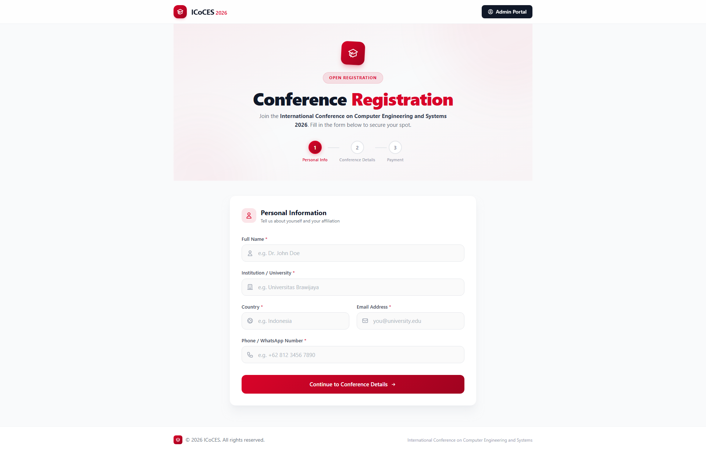
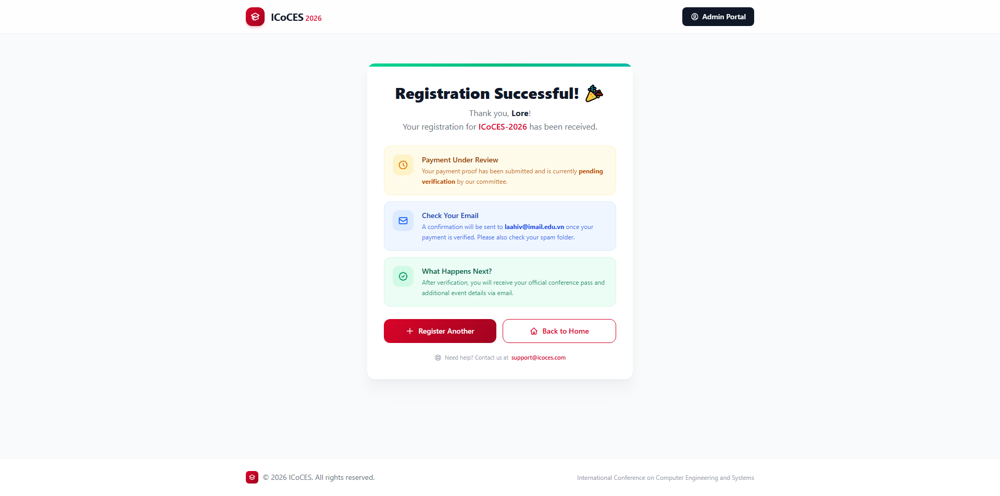
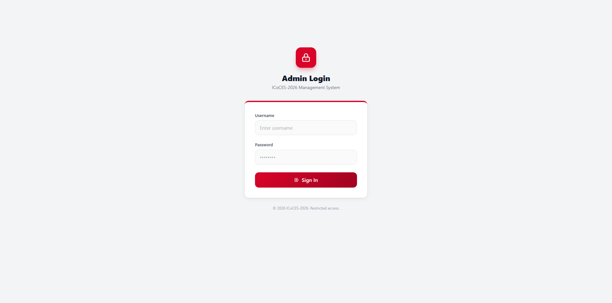
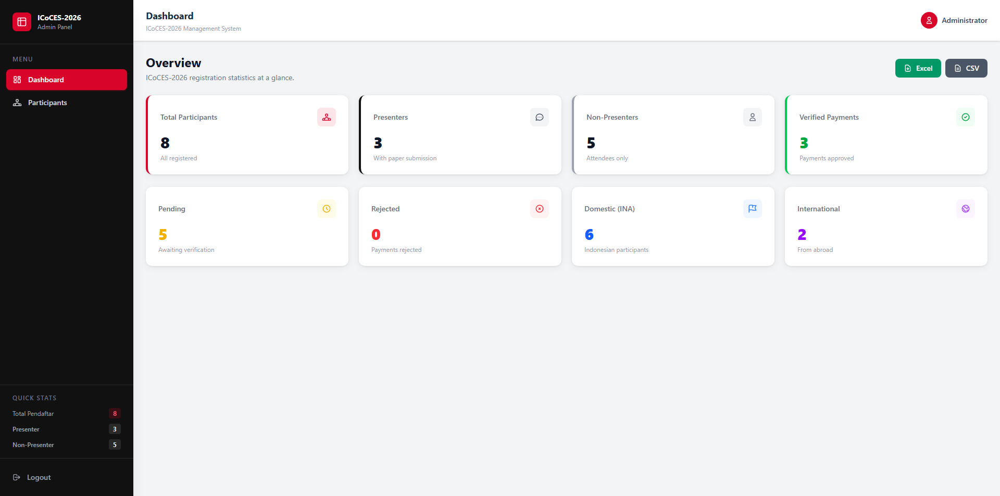
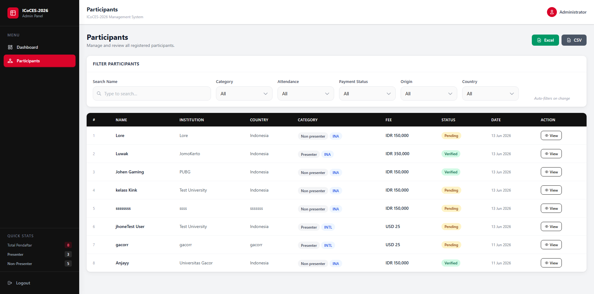
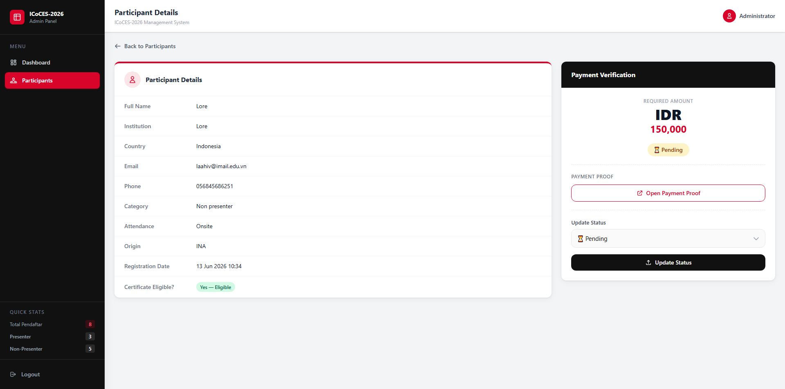

# ICoCES-2026 — Participant Registration System

<p align="center">
  
  
  
  
  
</p>

<p align="center">
  Sistem pendaftaran peserta konferensi <strong>International Conference on Computer Engineering and Systems 2026</strong>.
  Dibangun dengan Laravel 10, TailwindCSS v4.3, dan MySQL — desain responsif mobile-first.
</p>

---

## 📸 Demo Screenshots

| Halaman | Preview |
|---|---|
| **Form Pendaftaran (Publik)** |  |
| **Halaman Sukses** |  |
| **Admin Login** |  |
| **Dashboard Admin** |  |
| **Daftar Peserta** |  |
| **Detail Peserta** |  |

---

## ✨ Fitur Utama

### 🌐 Halaman Publik (Form Pendaftaran)
- **Multi-step form** 3 langkah dengan validasi per langkah
- Pilihan kategori: **Presenter** / **Non-Presenter**
- Pilihan kehadiran: **On-site** / **Online**
- Pilihan asal: **Domestik (INA)** / **Internasional (Intl)**
- Field **Judul Paper** muncul otomatis jika kategori = Presenter
- **Kalkulasi tarif otomatis** berdasarkan kategori & asal
- Upload bukti pembayaran (JPG / PNG / PDF, maks. 2MB)
- **Email konfirmasi** otomatis setelah pendaftaran berhasil
- Desain responsif — optimal di desktop maupun mobile

### 🔐 Admin Panel
- Login dengan **autentikasi custom guard** (`admin`)
- **Dashboard** dengan statistik ringkas:
  - Total Peserta, Presenter, Non-Presenter
  - Domestik vs Internasional
  - Status pembayaran: Pending / Verified / Rejected
- **Tabel peserta** dengan filter otomatis (tanpa klik tombol):
  - Filter Category, Attendance, Payment Status, Origin, Country
  - Search nama dengan **debounce 500ms**
  - **Collapsible filter** di mobile
- **Paginasi** 10 item per halaman dengan navigasi responsif
- **Detail peserta** lengkap + preview bukti pembayaran
- **Verifikasi pembayaran**: Pending → Verified / Rejected
- **Export** data peserta ke format **Excel (.xlsx)** dan **CSV**

---

## 💰 Kategori & Tarif Registrasi

| Kategori Peserta | Tarif |
|---|---|
| Presenter — Domestik (INA) | Rp 350.000 |
| Presenter — Internasional (Intl) | USD 25 |
| Non-Presenter — Domestik (INA) | Rp 150.000 |
| Non-Presenter — Internasional (Intl) | USD 10 |

---

## 🗂️ Struktur Database

### Tabel `admins`
| Kolom | Tipe | Keterangan |
|---|---|---|
| `id` | bigint (PK) | Auto increment |
| `username` | varchar | Unique |
| `password` | varchar | Bcrypt hashed |
| `created_at` / `updated_at` | timestamp | — |

### Tabel `participants`
| Kolom | Tipe | Keterangan |
|---|---|---|
| `id` | bigint (PK) | Auto increment |
| `full_name` | varchar | Nama lengkap |
| `institution` | varchar | Institusi/universitas |
| `country` | varchar | Negara |
| `email` | varchar | Unique |
| `phone` | varchar | 10–15 karakter |
| `category` | enum | `presenter`, `non_presenter` |
| `attendance` | enum | `onsite`, `online` |
| `participant_origin` | enum | `ina`, `intl` |
| `paper_title` | varchar | Nullable (hanya Presenter) |
| `fee_amount` | decimal | Dihitung otomatis backend |
| `fee_currency` | varchar | `IDR` atau `USD` |
| `payment_proof` | varchar | Path file upload |
| `payment_status` | enum | `pending`, `verified`, `rejected` |
| `certificate_eligible` | boolean | Otomatis: Non-Presenter Onsite |
| `created_at` / `updated_at` | timestamp | — |

---

## ⚙️ Cara Menjalankan Aplikasi

### Prasyarat
- PHP **8.3** atau lebih baru
- Composer
- Node.js **18+** & npm
- MySQL **8.0+**

---

### Langkah Instalasi

**1. Clone / ekstrak project**
```bash
cd form-v2
```

**2. Install dependensi PHP**
```bash
composer install
```

**3. Install dependensi Node.js**
```bash
npm install
```

**4. Salin file environment**
```bash
cp .env.example .env
```

**5. Generate application key**
```bash
php artisan key:generate
```

**6. Konfigurasi database di `.env`**
```env
DB_CONNECTION=mysql
DB_HOST=127.0.0.1
DB_PORT=3306
DB_DATABASE=icoces2026
DB_USERNAME=root
DB_PASSWORD=your_password
```

> Pastikan database `icoces2026` sudah dibuat terlebih dahulu di MySQL.

**7. Jalankan migrasi & seeder**
```bash
php artisan migrate --seed
```

> Seeder akan membuat akun admin default.

**8. Buat symlink storage**
```bash
php artisan storage:link
```

**9. Konfigurasi email (opsional — untuk konfirmasi email)**

Edit `.env`:
```env
MAIL_MAILER=smtp
MAIL_HOST=smtp.mailtrap.io
MAIL_PORT=2525
MAIL_USERNAME=your_mailtrap_username
MAIL_PASSWORD=your_mailtrap_password
MAIL_FROM_ADDRESS=noreply@icoces2026.com
MAIL_FROM_NAME="ICoCES-2026"
```

---

### Menjalankan Server

Buka **dua terminal** secara bersamaan:

**Terminal 1 — PHP Server:**
```bash
php artisan serve
```

**Terminal 2 — Asset compiler (Vite):**
```bash
npm run dev
```

Aplikasi dapat diakses di: **http://127.0.0.1:8000**

---

## 🔑 Akun Admin Default

| Field | Value |
|---|---|
| **URL** | http://127.0.0.1:8000/admin/login |
| **Username** | `admin` |
| **Password** | `password` |

> Ganti password setelah login pertama kali untuk keamanan.

---

## 🗺️ Daftar Route

| Method | URL | Deskripsi |
|---|---|---|
| `GET` | `/` | Form pendaftaran publik |
| `POST` | `/` | Submit form pendaftaran |
| `GET` | `/success` | Halaman konfirmasi sukses |
| `GET` | `/admin/login` | Halaman login admin |
| `POST` | `/admin/login` | Proses login admin |
| `POST` | `/admin/logout` | Logout admin |
| `GET` | `/admin/dashboard` | Dashboard admin |
| `GET` | `/admin/participants` | Daftar peserta (+ filter) |
| `GET` | `/admin/participants/{id}` | Detail peserta |
| `PATCH` | `/admin/participants/{id}/payment` | Update status pembayaran |
| `GET` | `/admin/export/excel` | Export Excel |
| `GET` | `/admin/export/csv` | Export CSV |

---

## 📁 Struktur Project

```
form-v2/
├── app/
│   ├── Http/Controllers/
│   │   ├── AdminController.php      # Dashboard, participants, export
│   │   └── RegistrationController.php  # Form publik
│   ├── Mail/
│   │   └── PaymentVerifiedMail.php  # Email notifikasi
│   └── Models/
│       ├── Admin.php
│       └── Participant.php
├── database/
│   ├── migrations/                  # Skema tabel
│   └── seeders/
│       └── AdminSeeder.php          # Akun admin default
├── resources/
│   ├── css/app.css                  # TailwindCSS v4 + komponen
│   ├── js/app.js
│   └── views/
│       ├── layouts/
│       │   ├── app.blade.php        # Layout publik
│       │   └── admin.blade.php      # Layout admin (sidebar responsif)
│       ├── registration/
│       │   ├── create.blade.php     # Form pendaftaran (3-step)
│       │   └── success.blade.php    # Halaman sukses
│       └── admin/
│           ├── login.blade.php
│           ├── dashboard.blade.php
│           └── participants/
│               ├── index.blade.php  # Tabel + filter + pagination
│               └── show.blade.php   # Detail peserta
├── routes/web.php
└── storage/app/public/payments/     # Upload bukti pembayaran
```

---

## 🛡️ Keamanan

- ✅ **CSRF Protection** — semua form dilindungi token CSRF
- ✅ **Server-side validation** — validasi di controller, bukan hanya JavaScript
- ✅ **Password hashing** — bcrypt via `Hash::make()`
- ✅ **Protected admin routes** — middleware `auth:admin`
- ✅ **File upload validation** — tipe & ukuran divalidasi server-side
- ✅ **Custom admin guard** — terpisah dari guard user biasa

---

## 📦 Dependensi Utama

### PHP (composer.json)

| Package | Versi | Fungsi |
|---|---|---|
| `php` | ^8.1 | Runtime |
| `laravel/framework` | ^10.10 | Framework utama |
| `laravel/sanctum` | ^3.3 | API authentication |
| `laravel/tinker` | ^2.8 | REPL Laravel |
| `spatie/simple-excel` | ^3.7 | Export Excel & CSV |
| `guzzlehttp/guzzle` | ^7.2 | HTTP client |

### Node.js (package.json)

| Package | Versi | Fungsi |
|---|---|---|
| `tailwindcss` | ^4.3.0 | CSS framework |
| `@tailwindcss/vite` | ^4.3.0 | Integrasi Tailwind + Vite |
| `vite` | ^5.0.0 | Asset bundler |
| `laravel-vite-plugin` | ^1.0.0 | Integrasi Vite + Laravel |
| `axios` | ^1.6.4 | HTTP client JS |

---

## 👤 Pembuat

> Dibuat sebagai submission untuk **Soal 2 — Aplikasi Web Pendaftaran Peserta ICoCES-2026**

---

<p align="center">
  Made with ❤️ using <strong>Laravel 10</strong> + <strong>TailwindCSS v4.3</strong>
</p>
